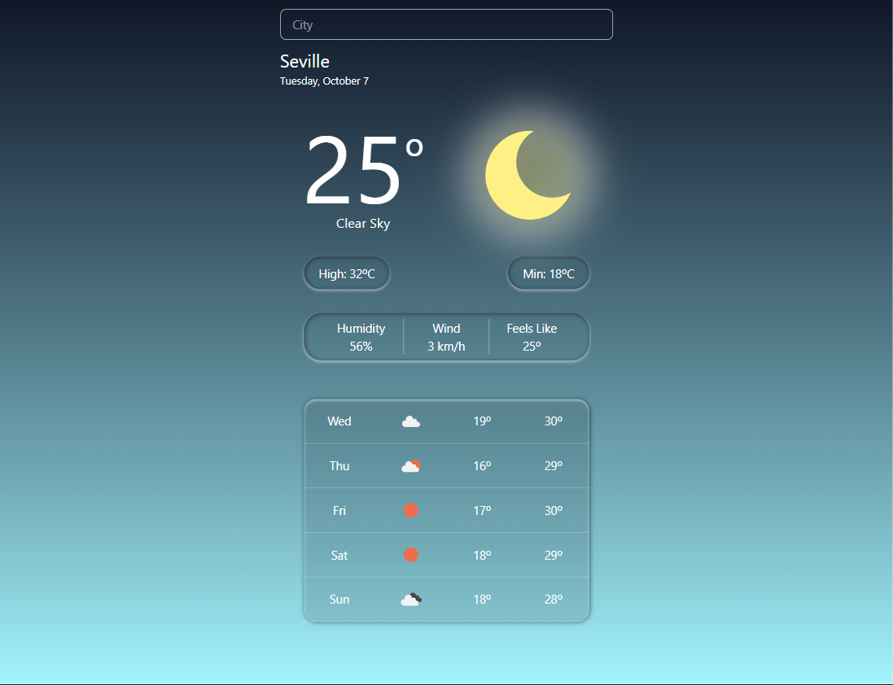

# WeatherApp

A modern, interactive weather application built with Vite and Tailwind CSS. It displays daily forecasts, maximum and minimum temperatures, dynamic weather icons, and allows real-time city search.



---

## Table of Contents

1. [About](#about)
2. [Technologies](#technologies)
3. [Features](#features)
4. [Challenges & Learning](#challenges--learning)
5. [Resources](#resources)
6. [Setup & Installation](#setup--installation)
7. [Usage](#usage)
8. [License](#license)

---

## About

WeatherApp provides accurate daily forecasts and intuitive weather insights, leveraging OpenWeather API data. The app is fully responsive and visually appealing thanks to Tailwind CSS.

---

## Technologies

- **Vite** - Build tool and development server
- **React** - Component-based UI library
- **Tailwind CSS** - Utility-first CSS framework
- **OpenWeather API** - Weather data provider
- **Framer Motion** - Animations (optional)
- **JavaScript (ES6+)**

---

## Features

- Display daily weather forecasts with max/min temperatures
- Dynamic weather icons based on API data
- Real-time city search with state management
- Conditional rendering for error handling and loading states
- Responsive design with Tailwind CSS

---

## Challenges & Learning

During development, I tackled several interesting challenges and learned key skills:

- **Tailwind CSS mastery:** Utility-first approach, responsive layouts, dynamic styling
- **State management in React:** Handling asynchronous API data
- **API calls:** Fetching and rendering data dynamically from OpenWeather
- **Conditional and dynamic rendering:** Showing different UI elements based on data or state
- **Search logic:** Implementing a real-time city search system

The **Tailwind documentation** was incredibly clear, complete, and a constant reference. The **OpenWeather API docs** were less clear and less detailed, but essential for understanding data structure and endpoints.

---

## Resources

- [Tailwind CSS Documentation](https://tailwindcss.com/docs)
- [OpenWeather API Documentation](https://openweathermap.org/api)

---

## Setup & Installation

1. Clone the repository:

```bash
git clone https://github.com/Radu-A/weather-app
```
